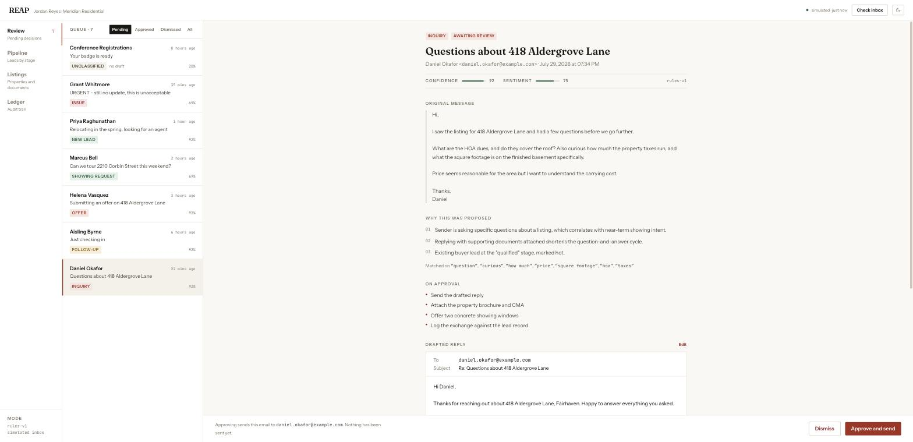
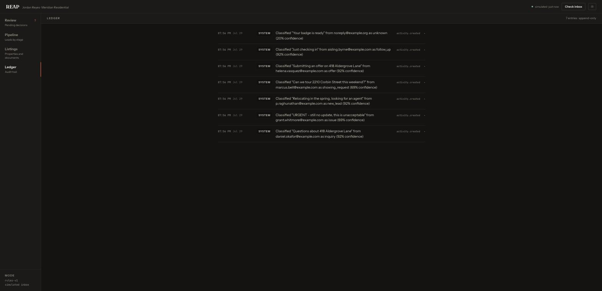

# REAP — Real Estate Agent Platform

A human-in-the-loop AI operations desk for residential real estate agents.

REAP watches an agent's inbox, classifies each inbound message, drafts a reply
with its reasoning attached, and then **stops**. Nothing is sent, no lead is
advanced, and no document leaves the building until a licensed human approves
it. Every proposal, edit, approval, and dismissal is written to an append-only
ledger.

That constraint is the product. An AI that autonomously answers client mail on
behalf of a licensed professional is a liability; one that drafts, explains
itself, and waits is leverage.



---

## Run it

```bash
git clone https://github.com/jyamini26/RE_Agent_Code0.git
cd RE_Agent_Code0
npm install
npm run build --workspace=@reap/shared   # apps import the compiled contracts
npm run dev
```

Open <http://localhost:5173>.

**No `.env`, no API keys, no database to install.** On first boot the API
creates a SQLite file, seeds four listings and seven leads, and replays a
scripted inbox through the classifier, so the dashboard is populated the moment
it loads. Copy `.env.example` to `.env` only when you want to change something.

| Command             | Effect                                   |
| ------------------- | ---------------------------------------- |
| `npm run dev`       | API on `:3001`, web on `:5173` (proxied) |
| `npm test`          | 133 tests across all three workspaces    |
| `npm run typecheck` | `tsc --noEmit` everywhere                |
| `npm run lint`      | ESLint                                   |
| `npm run build`     | Production build of every workspace      |
| `npm run seed`      | Re-seed an empty database                |

Requires Node 20+.

---

## What it does

**Review** — the queue. Each row is an inbound message that has been classified
and drafted. Opening one shows the original text, the reasoning behind the
suggestion, exactly which keywords the classifier matched, what will happen on
approval, and the draft itself. You can edit the draft before approving; edits
must be saved before the send button unlocks, so the text in the audit trail is
always the text that actually went out.

**Pipeline** — leads by stage. Approving a reply advances the matching lead, but
only ever forward: a buyer who asks a question after touring is not dragged from
`showing` back to `qualified`.


**Listings** — properties, and one-click generation of real PDFs (comparative
market analysis, brochure) rendered with pdfkit and stamped with the configured
agent's identity.


**Ledger** — the append-only audit trail. Every classification, edit, approval,
dismissal, and document is recorded with actor, timestamp, and a JSON detail
payload. For a draft that was edited, the detail holds both the before and the
after.



Both themes are supported throughout; the toggle sits in the masthead and
respects the system preference until you override it.

---

## Architecture

```
packages/shared     Zod schemas + inferred types. One source of truth for the
                    domain, imported by both the API and the web client, so a
                    contract change is a compile error on both sides.

apps/api            Express + TypeScript + SQLite (better-sqlite3)
  routes/           HTTP only: validate, delegate, shape the response
  services/         Domain logic. No Express types cross this boundary.
    inbox/          InboxProvider strategy — simulated | gmail
    classifier/     Classifier strategy — rules | anthropic
    ingestion.ts    inbox -> classify -> suggest -> file for review
    activityService Approve / modify / dismiss. The human-in-the-loop gate.
    suggestions.ts  Draft templates, exhaustive over the Intent union
    documents.ts    PDF rendering and CMA arithmetic
  repositories/     The only code that writes SQL
  db/               Schema, connection, seed data

apps/web            React 19 + Vite + Tailwind 4 + TanStack Query
```

### Decisions worth explaining

**Two strategy interfaces, so the repository runs with nothing installed.**
`InboxProvider` has a `SimulatedInboxProvider` that replays seven scripted
emails and a `GmailInboxProvider` that polls a real mailbox. `Classifier` has a
deterministic keyword implementation and an Anthropic-backed one. The default of
each needs no credentials, which is why `git clone && npm install && npm run
dev` produces a working, populated application rather than an empty shell and a
setup guide. Swapping either is one environment variable.

**Suggestion templates are exhaustive by construction.** `TEMPLATES` is declared
`as const satisfies Record<Intent, Template>`. Adding a member to the `Intent`
union without writing a template for it fails the build. This is a direct fix
for the defect in the prototype this replaces, which keyed templates off a plain
object literal and returned `undefined` — and then crashed — on the first
message classified as an intent nobody had anticipated.

**Documents are deleted by id, not filename.** `DELETE /api/documents/:id` looks
the record up and passes the _stored_ filename to the filesystem, so no
user-controlled string ever reaches a path. `resolveWithinDirectory` is a second
layer that rejects anything resolving outside the documents directory, including
the sibling-prefix case (`/docs-evil` against a base of `/docs`) that a naive
`startsWith` check would let through. Both are tested.

**The audit repository has no update or delete method.** Not by oversight. The
compliance argument for an AI drafting client correspondence rests entirely on
the record of what it proposed and what the human changed being immutable.

**Delivery is stubbed by default.** The default `Mailer` logs instead of
sending. Shipping a portfolio application that can email real strangers if
someone sets the wrong variable is not a trade worth making, so real delivery is
opt-in. The approve path is still exercised end to end in tests via a stub that
can be told to fail — a delivery failure marks the activity `failed` and sends
nothing, rather than recording a success that never happened.

**The API returns `{ data }` or `{ error }`, never a bare value.** Clients
discriminate on the envelope instead of parsing status codes, which keeps error
handling in one place in `apps/web/src/lib/api.ts`.

**Approval is a POST to a sub-resource,** not a PATCH on a status field. The one
operation with an outward-facing side effect is explicit in the access log.

---

## Testing

133 tests. `npm test`.

- **Integration** (`apps/api/src/test/`) — real HTTP through supertest against a
  full application built over an in-memory SQLite database and a stub mailer.
  Each test constructs its own isolated instance. These cover the whole approval
  lifecycle: double-approval returns 409 and does not send twice, delivery
  failure marks the activity failed and sends nothing, an edited draft is the
  one that gets delivered, resolved activities reject further changes.
- **Unit** — classifier behaviour across every intent, template exhaustiveness,
  CMA valuation arithmetic (including the per-comparable-rate averaging that
  resists one large home skewing the result), path-traversal defences, and the
  formatting helpers.
- **Component** (`apps/web`) — Testing Library over `CaseFile`, asserting the
  gates that matter: no approve button without a draft, no approve with unsaved
  edits, no controls at all once resolved.

CI runs typecheck, lint, format check, tests, and build on Node 20 and 22, plus
a dependency audit and a smoke test that boots the built artifact and asserts it
serves a populated queue.

---

## Configuration

Every value has a working default; see `.env.example`. The ones that change
behaviour:

| Variable         | Default          | Effect                                |
| ---------------- | ---------------- | ------------------------------------- |
| `INBOX_PROVIDER` | `simulated`      | `gmail` polls a real mailbox          |
| `CLASSIFIER`     | `rules`          | `anthropic` uses the Claude API       |
| `AGENT_*`        | demo values      | Identity on drafts and generated PDFs |
| `DATABASE_PATH`  | `./data/reap.db` | `:memory:` for an ephemeral run       |

Selecting `gmail` or `anthropic` without the matching credentials fails at boot
with a message naming what is missing, rather than at the first poll five
minutes later.

---

## Notes

All names, addresses, and email domains in the seed and fixture data are
invented, and the domains are reserved (`example.com`, `.example`) so nothing in
this repository can reach a real inbox.

MIT licensed.
